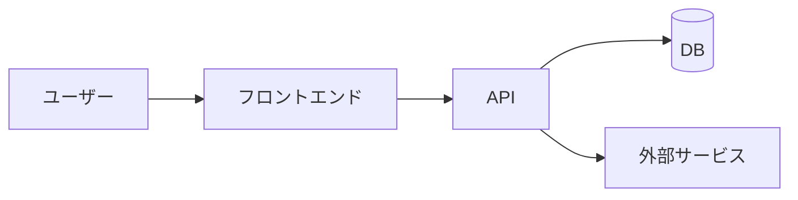

<div class="flex flex-col justify-center h-full">

# 発表タイトルをここに

<div class="mt-6 space-y-1 text-lg opacity-80">
  <div>yyyy-mm-dd ・ 勉強会名</div>
  <div>サブタイトル / 一言で何の話か</div>
  <div>@aki05162525</div>
</div>

</div>

<div class="abs-br m-6 text-xl">
  <a href="https://twitter.com/aki05162525" target="_blank" class="slidev-icon-btn"><carbon:logo-x /></a>
  <a href="https://github.com/" target="_blank" class="slidev-icon-btn"><carbon:logo-github /></a>
</div>

<!--
発表メモはここに書く。プレゼンターモードで見える。
-->

---
layout: two-cols
layoutClass: gap-12
---

# 自己紹介

<div class="mt-4 space-y-3 text-lg">

- **名前** … あなたの名前
- **所属** … 会社 / チーム
- **やってること** … フロントエンド / バックエンド など
- **最近の関心** … 興味のある技術

</div>

<div class="mt-8 flex gap-3 text-2xl opacity-80">
  <carbon:logo-github />
  <carbon:logo-x />
  <carbon:email />
</div>

::right::

<div class="flex items-center justify-center h-full">
  
</div>

---
layout: center
class: text-center
---

# 今日話すこと

<div class="text-left inline-block mt-6 text-xl">

1. 背景・課題
2. やったこと
3. デモ
4. ハマったところ
5. まとめ

</div>

---
layout: section
---

# 1. 背景・課題

なぜこれをやろうと思ったか

---

# 課題

<div class="grid grid-cols-2 gap-6 mt-6">

<div class="p-5 rounded-lg bg-red-50 border border-red-200">

### 😣 Before

- 手作業で時間がかかっていた
- ミスが起きやすかった
- 属人化していた

</div>

<div class="p-5 rounded-lg bg-green-50 border border-green-200">

### 😄 After

- 自動化して数分で完了
- ミスがほぼゼロに
- 誰でも実行できる

</div>

</div>

<div class="mt-8 text-center text-lg opacity-70">
  → このギャップを埋めるために作った
</div>

---

# 2. やったこと

ポイントは3つ

<div class="grid grid-cols-3 gap-4 mt-8">
  <div v-click class="p-4 rounded-lg border border-gray-200 shadow-sm">
    <div class="text-3xl mb-2"><carbon:idea /></div>
    <div class="font-bold">アイデア</div>
    <div class="text-sm opacity-70 mt-1">何を解決するか決める</div>
  </div>
  <div v-click class="p-4 rounded-lg border border-gray-200 shadow-sm">
    <div class="text-3xl mb-2"><carbon:tools /></div>
    <div class="font-bold">実装</div>
    <div class="text-sm opacity-70 mt-1">小さく作って試す</div>
  </div>
  <div v-click class="p-4 rounded-lg border border-gray-200 shadow-sm">
    <div class="text-3xl mb-2"><carbon:rocket /></div>
    <div class="font-bold">運用</div>
    <div class="text-sm opacity-70 mt-1">回しながら改善</div>
  </div>
</div>

---

# コード例

ハイライトしたい行を `{}` で指定できます

```ts {all|2|4-5|all}
// 設定を読み込む
const config = loadConfig()

// 処理を実行
const result = await run(config)

console.log(result)
```

<div class="mt-4 text-sm opacity-70">
  <code>{2}</code> で1行、<code>{4-5}</code> で範囲、<code>{all}</code> で全体をハイライト
</div>

---

# 3. デモ

<div class="flex items-center justify-center h-90">
  <div class="text-center">
    <div class="text-6xl mb-4"><carbon:play-filled-alt /></div>
    <div class="text-xl opacity-70">ここで実際に動かす</div>
  </div>
</div>

---

# 構成図



---

# 数式（TeX / KaTeX）

Slidev は標準で $\TeX$ 記法に対応しています（[KaTeX](https://katex.org/) 製）

<div class="grid grid-cols-2 gap-8 mt-6">

<div>

**インライン**

文中に $E = mc^2$ のように書けます。
ギリシャ文字 $\alpha, \beta, \gamma$ や
分数 $\frac{1}{2}$ もそのまま。

```md
文中に $E = mc^2$ のように書けます。
```

</div>

<div>

**ブロック**

$$
\sum_{i=1}^{n} i = \frac{n(n+1)}{2}
$$

```md
$$
\sum_{i=1}^{n} i = \frac{n(n+1)}{2}
$$
```

</div>

</div>

---

# 数式のアニメーション

ブロック数式は行ごとにハイライト／表示できます（`{1|2|all}`）

$$ {1|2|3|all}
\begin{aligned}
f(x)   &= ax^2 + bx + c \\
f'(x)  &= 2ax + b \\
f''(x) &= 2a
\end{aligned}
$$

<div class="mt-6 text-sm opacity-70">

行列やソフトマックスなどもそのまま書けます：

$$
\mathrm{softmax}(x_i) = \frac{e^{x_i}}{\sum_{j} e^{x_j}}
$$

</div>

[詳しくはドキュメント](https://sli.dev/features/latex)

---

# 4. ハマったところ

<div class="space-y-4 mt-6 text-lg">

<div v-click class="flex gap-3">
  <carbon:warning-alt class="text-orange-500 text-2xl shrink-0 mt-1" />
  <div><b>問題1</b> … 〇〇でエラーが出た → △△で解決</div>
</div>

<div v-click class="flex gap-3">
  <carbon:warning-alt class="text-orange-500 text-2xl shrink-0 mt-1" />
  <div><b>問題2</b> … 想定外の挙動 → ドキュメントを読み直した</div>
</div>

<div v-click class="flex gap-3">
  <carbon:checkmark-outline class="text-green-500 text-2xl shrink-0 mt-1" />
  <div><b>学び</b> … 早めに小さく試すのが大事</div>
</div>

</div>

---
layout: center
class: text-center invert
---

# そもそも、本当にこれで合ってる？

<div class="mt-6 text-xl opacity-60">
  ここで一度立ち止まって問いかける
</div>

<!-- 反転スタイルは styles/index.css の .invert で共通定義（class に "invert" を足すだけ） -->

---
layout: center
class: text-center
---

# 5. まとめ

<div class="text-left inline-block mt-6 text-xl space-y-2">

- 課題を **自動化** で解決した
- 小さく作って改善するのが効いた
- まだ伸びしろがある

</div>

---
layout: center
class: text-center
---

# ありがとうございました 🙌

質問・感想お待ちしています

<div class="mt-8 flex justify-center gap-4 text-3xl opacity-80">
  <carbon:logo-github />
  <carbon:logo-x />
  <carbon:email />
</div>
